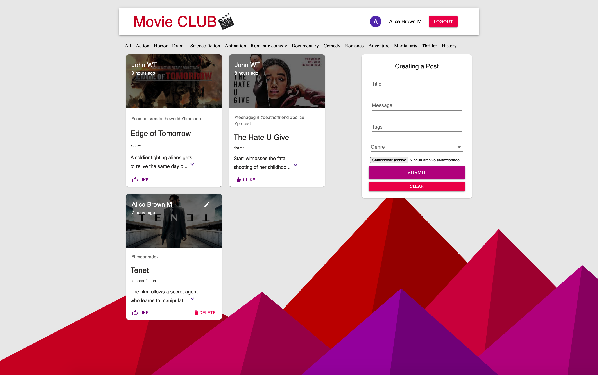

# MOVIE CLUB

In progress ... ☕︎

</img>

## How to setup environment variables

#### config file

In the client side of the project (`client/src/config.json`) for the Google login:

```json
{
  "CLIENT_ID": "GOOGLE LOGIN CLIENT ID"
}
```

#### .env file

In the server side of the project (`server/.env`) to conect the application with the data base:

```
CONNECTION_URL = "MONGO URL STRING"
```

## Run the application in local

`npm i && npm start` for both client and server side to start the app


This project was bootstrapped with [Create React App](https://github.com/facebook/create-react-app).
